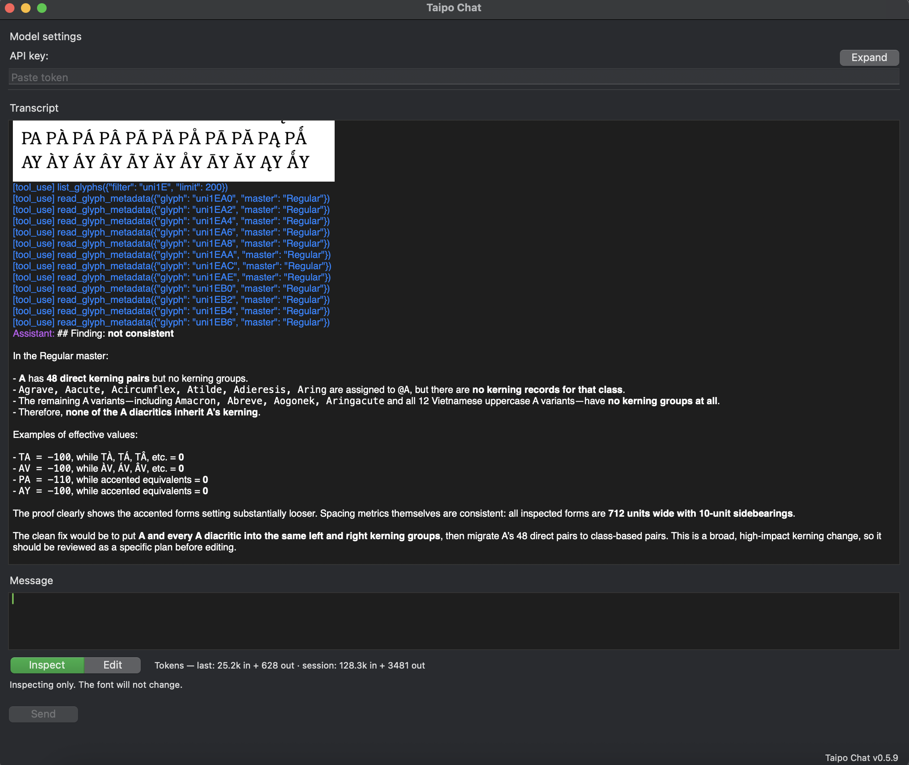

<p align="center">
  
</p>

# Taipo Chat

**Taipo Chat** is a chat assistant that lives inside **Glyphs**. You describe a font problem in ordinary language; the assistant reads outlines, kerning, metadata, and rendered specimens — and can apply edits when you ask it to.

Sessions start in **Inspect** (read-only): look, compare, and diagnose freely. Switch to **Edit** when you want changes; Taipo proposes a plan and asks you to confirm before touching anything.

Taipo Chat connects to **OpenAI's GPT** by default. You need an internet connection and a **GPT API key** (see Quickstart). Your font file stays on your Mac; only what the session needs is sent to the configured host.

→ **[taipo.chat](https://taipo.chat)** — demo video and product overview.

## What it can do

Example prompts:

- *"The serifs on my f are inconsistent — fix them."*
- *"These nodes are misaligned; tighten them up."*
- *"The spacing looks off between these pairs."*
- *"Are all A diacritics kerning consistently with the base A?"*

Taipo Chat is aimed at **targeted fixes and explanations** — spacing hints, outline tweaks, kerning consistency, metadata checks — not a full replacement for your eye or for manual drawing.

In **Inspect**, the assistant can look, compare, and diagnose but cannot change the font. Switch to **Edit** to unlock mutation tools; Taipo is still instructed to propose a plan and ask before applying changes. After edits it overlays a red/green diff against an earlier render from the same session to confirm the fix worked.



## Requirements

- **Glyphs 3 or 4** on **macOS** (same as the Glyphs app).
- **Python** and **Vanilla** modules from Glyphs' Plugin Manager, plus Glyphs' bundled Python selected in Settings (see **Prepare Glyphs** below).
- A **stable internet** connection while you chat.

## Quickstart

### 1) Prepare Glyphs

Taipo Chat depends on Glyphs' own **Python** and **Vanilla** modules (Glyphs' scripting UI stack — not something you install from python.org). Without the steps below, Glyphs may use your system Homebrew Python instead, and Taipo Chat will not load.

1. **Window → Plugin Manager → Modules** — install **Python** and **Vanilla**.
2. **Glyphs → Settings → Addons** — set **Python version** to **3.* (Glyphs)**. See the [Glyphs Addons handbook](https://handbook.glyphsapp.com/settings/addons/) if the option is missing.
3. **Restart Glyphs.**

### 2) Install Taipo

**Plugin Manager (recommended):** In Glyphs, open **Window → Plugin Manager → Plugins**, search for **Taipo Chat**, and click **Install**. Restart Glyphs.

**Manual install:** Download the latest archive from **[GitHub Releases](https://github.com/zimka/taipo/releases/latest)**, unpack it, and **double-click** **`TaipoChat.glyphsPlugin`** to install. If nothing happens, use **Glyphs → Settings → Addons → Install Plugin…** and choose the same file.

### 3) OpenAI GPT API key

Taipo Chat is preset for OpenAI: **Base URL** `https://api.openai.com` and **Model** `gpt-5.4`. You only need a **GPT API key** in most cases.

1. **Create an API key:** Sign in to OpenAI, add a payment method if required, then create a secret key in the account dashboard. See **[OpenAI quickstart](https://developers.openai.com/api/docs/quickstart)**.
2. **Open Taipo Chat:** **Window → Taipo Chat** (the menu label may follow your Glyphs language).
3. Paste the key into **API key** at the top of the window. Leave **Base URL** and **Model** as they are unless you are switching providers (see below).

**Cost:** GPT usage is **billed by OpenAI**, not by Taipo Chat. Pricing is on OpenAI's site.

### 4) Start chatting

1. Open a font.
2. Confirm your **API key** is set (**Base URL** and **Model** are prefilled for OpenAI).
3. Describe the issue in the **Message** field and press **Send**.
4. Stay in **Inspect** to look and compare. Switch to **Edit** when you want Taipo to change the font, then agree to the plan in the chat.

## Other providers and changing hosts

Taipo Chat talks to any host that exposes the same **chat-completions** HTTP pattern OpenAI uses (several vendors and gateways are compatible).

To switch away from OpenAI:

1. Set **Base URL** to the **root** URL your vendor documents for this API (for OpenAI itself, keep `https://api.openai.com` with **no** extra `/v1` path—Taipo Chat adds `/v1/chat/completions`). Other hosts may differ; follow their documentation.
2. Set **Model** to the **exact model name** your vendor expects (for example a deployment id or regional model string).
3. Paste that provider's **API key** (or token) in **API key**.

If something fails after a change, restore **Base URL** `https://api.openai.com` and **Model** `gpt-5.4`, confirm billing and model access on the provider, then try again.

### Local inference on Apple Silicon

Taipo Chat can run against a local model served by **Ollama** or **MLX** on a Mac with M1 or later. Point **Base URL** at the local server and set **Model** to the model name (for example `Qwen-3.5-3a35b` with MLX). In practice local models are significantly slower and less capable than a hosted GPT model, and configuring a local inference server is not straightforward — here be dragons.

## The Taipo Chat window


One window combines settings and chat. **API key** is always visible; click **Expand** to show Base URL, Model, Max tokens, System prompt, and **Show Debug Info** (tool inputs/outputs in the transcript). Click **Collapse** to hide them again.

The **Transcript** is read-only. Assistant replies use markdown; specimen and diff images appear inline—click a thumbnail to open a zoomable preview. In **Message**, **Return** sends, **Shift+Return** adds a new line, and **⌘Return** also sends.

| Area | Purpose |
|------|--------|
| **API key** + **Expand** | Key always visible; Expand/Collapse for host, model, token limit, system prompt, debug info |
| **Transcript** | Conversation, formatted replies, specimen/diff images |
| **Message** | Your prompt |
| **Inspect \| Edit** | Inspect = read-only. Edit = changes allowed after you agree a plan in chat |
| **Status + tokens** | Mode hint ("Inspecting only…") and token usage for the last turn / session |
| **Send / Cancel** | Send starts a turn; the button becomes Cancel while the assistant is working |

## Privacy

Taipo Chat transmits **your messages** and **content retrieved for the assistant**—including **glyph names**, **outline data**, **kerning values**, **glyph metadata**, and **rendered specimen images** when the session requests them—to the **Base URL** you set. That processing is governed by **your provider's** policies and infrastructure (including any subprocessors they use).

Use Taipo Chat only for fonts and projects where sending such material to a **third-party service** is permitted under your agreements and obligations.

Your **API key** is stored in **Glyphs' preferences** on your Mac, in line with other extensions. Taipo Chat uses it only to authenticate requests to the **Base URL** you entered.

### OpenAI and training data

If your **Base URL** points to **OpenAI**, their API documentation states that customer API data is not used to train models by default. From **[Your data](https://developers.openai.com/api/docs/guides/your-data)**:

> Your data is your data. As of March 1, 2023, data sent to the OpenAI API is not used to train or improve OpenAI models (unless you explicitly opt in to share data with us).

Provider policies and account settings can change; review the current terms on their site when handling sensitive work. **Other hosts** apply their own rules—consult their documentation when you are not using OpenAI.

## Saving your work

- **Save your `.glyphs` file** before long sessions, like any serious edit. Close the file without saving if you want to discard the session's edits.

## Troubleshooting

| Problem | What to try |
|--------|-------------|
| **"Python" / "Vanilla" errors** | Install both modules from **Plugin Manager → Modules**, set **Python version** to **3.* (Glyphs)** under **Settings → Addons**, then restart Glyphs. |
| **HTTP errors or "unauthorized"** | Confirm the key is valid, the account can call the chosen **Model**, and billing is active. |
| **Wrong or empty replies** | For OpenAI, **Base URL** should be `https://api.openai.com` with no path after the host. After switching providers, verify **Base URL** and **Model** match that vendor's docs. |
| **Nothing changes** | The session starts in **Inspect**. Switch to **Edit** to apply mutations. |
| **Stuck or slow** | **Cancel** if shown. |

For bugs or features, use **[Issues](https://github.com/zimka/taipo/issues)** on the repository.

## Updates

New versions are published on **[Releases](https://github.com/zimka/taipo/releases/latest)**. Download the latest **`TaipoChat.glyphsPlugin.zip`**, unzip, and **double-click** the `.glyphsPlugin` again to replace the previous install, or install via **Preferences → Add-ons**.

## Source code

Developers can browse or contribute in the **[taipo](https://github.com/zimka/taipo)** repository on GitHub.

### Running tests

All tests live under `TaipoChat.glyphsPlugin/Contents/Resources/tests/`. Entry points: `run_smoke()` and `run_glyphs_tests()` in [`tests/__init__.py`](TaipoChat.glyphsPlugin/Contents/Resources/tests/__init__.py).

| File | Purpose |
|------|---------|
| `smoke.py` | API/tool smoke tests (mock fonts, no Glyphs) |
| `glyphs.py` | Glyphs 3/4 integration tests (Macro Panel) |
| `mock.py` | Mock font/layer graph for smoke tests |
| `_glyphs_sdk.py` | GlyphsApp import helpers and cross-version factories |

**Smoke tests** (no Glyphs required):

```bash
uv run python TaipoChat.glyphsPlugin/Contents/Resources/tests/smoke.py
```

**Glyphs integration tests** (Glyphs 3 or 4 Macro Panel, font open):

```python
import sys; sys.path.insert(0, "/ABS/PATH/TaipoChat.glyphsPlugin/Contents/Resources")
import tests; tests.run_glyphs_tests()
```

The default agent system prompt is [`TaipoChat.glyphsPlugin/Contents/Resources/assets/system_prompt.md`](TaipoChat.glyphsPlugin/Contents/Resources/assets/system_prompt.md). Edit that file and restart Glyphs to pick up changes. Edits in the window's system prompt field apply for the current session only.

## License

Taipo Chat is licensed under the [MIT License](./LICENSE). See the LICENSE file for details.
